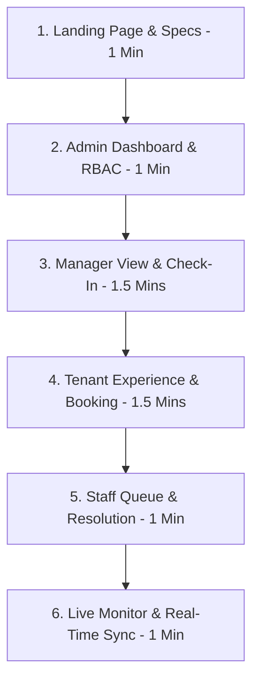

# PropertyFlow Portfolio Video Demo Guide
This guide outlines the recommended 6–8 minute recording flow for presenting the PropertyFlow SaaS application to stakeholders or portfolio review boards.

---

## Demo Preparation
1. **Reset & Seed Demo Data**: Run `npm run prisma:demo-seed` in the `backend/` directory to ensure the database is clean, populated with premium mock profiles, and metrics are calculated dynamically.
2. **Browser Windows**:
   - **Tab 1**: Public Landing Page (`http://localhost:3000/`)
   - **Tab 2**: (Incognito / Separate Browser) Real-Time Live Monitor (`http://localhost:3000/` logged in as Support Staff or Property Manager)
   - **Console/Terminal**: Ensure both backend and frontend dev servers are running.

---

## Recommended Demo Flow (6-8 Minutes)

### 1. Landing Page & Credentials (1:00)
* **Goal**: Showcase the responsive, premium SaaS marketing experience and access the demo credentials.
* **Actions**:
  1. Open `http://localhost:3000/` and scroll through the hero section. Draw attention to the GSAP scroll reveals, layout animations, and dark glassmorphic design.
  2. Click **View Demo Credentials** in the navigation header to open the credentials modal.
  3. Briefly point out the four pre-configured roles (System Administrator, Property Manager, Support Staff, Tenant) and their respective login accounts.
  4. Click **Get Started** to go to the Login screen.

---

### 2. System Administrator Dashboard (1:00)
* **Account**: `admin@propertyflow.com` | `password123`
* **Goal**: Show global portfolio oversight, property CRUD, and tenant metrics.
* **Actions**:
  1. Log in as System Admin. Note the automatic redirect directly to the Admin Dashboard interface.
  2. Point out the property statistics and the listing index showing our three seeded properties (**Verdant Pines**, **Grand Horizon**, and **Apex Tech Plaza**).
  3. Click **Add Property** to show the creation modal. Create a new dummy property (e.g., `"Ocean Breeze Suites"`, `"200 Ocean Blvd"`, Residential, `45` Units) and submit. Note that it immediately appears in the index.
  4. Click **Edit** on an existing property, replace its name, and save.
  5. Demonstrate the **User Management** panel, showcasing list viewing, profile updates, and role-based permissions editing.

---

### 3. Property Manager Dashboard & Check-In (1:30)
* **Account**: `manager@propertyflow.com` | `password123`
* **Goal**: Demonstrate active booking oversight, maintenance routing, and check-in/out workflows.
* **Actions**:
  1. Log out as Admin and log in as Manager Sarah Jenkins.
  2. Point out the dynamic Manager KPI cards showing the calculated SLAResolution (≈34 Hours) and User Satisfaction (4.8 / 5) based on seeded database records.
  3. Navigate to **Bookings** tab. Point out the active, completed, and cancelled bookings.
  4. Find the **Olympic Pool** booking for Alice Cooper marked as `IN_USE` (active booking).
  5. Locate a confirmed future booking (marked as `APPROVED`) and showcase the **Check-In** button. Click it and point out the state transition to `IN_USE`.
  6. Click **Check-Out** on the active booking to transition it to `COMPLETED`.

---

### 4. Tenant Experience & Booking Lifecycle (1:30)
* **Account**: `tenant.a@example.com` | `password123`
* **Goal**: Showcase self-service tenant booking, request filing, and rating feedback loop.
* **Actions**:
  1. Log in as Tenant Alice Cooper.
  2. Navigate to **Book Amenities** section. Select **Modern Gym** at Verdant Pines.
  3. Pick a time slot (e.g., `18:00 - 19:30`), input 1 guest, and click **Book Slot**. Note the overlap collision prevention will reject double bookings.
  4. Navigate to **Maintenance Requests** and click **New Request**. File a ticket:
     - **Title**: `Living Room Outlets Dead`
     - **Description**: `Two wall plug outlets near the window do not have any power.`
     - **Category**: `Electrical`
     - **Priority**: `Medium`
  5. Click **Submit**. The ticket will appear under the active requests list.
  6. Find a recently resolved ticket in the history and submit a **5-star Rating** with the comment: `"Awesome service, fixed in under an hour!"`.

---

### 5. Support Staff Queue & Status Resolution (1:00)
* **Account**: `staff@propertyflow.com` | `password123`
* **Goal**: Show technician dispatch and status transitions.
* **Actions**:
  1. Log in as Support Staff David Ross.
  2. Navigate to the **Maintenance Queue**. Locate Alice Cooper's new `Living Room Outlets Dead` ticket.
  3. Update its status to **In Progress** and assign it to yourself.
  4. Once resolved, update the status to **Completed**.
  5. Point out how the completion rate and SLA resolution are updated dynamically.

---

### 6. Real-Time Activity Monitoring (1:00)
* **Goal**: Show the WebSocket-driven audit feed demonstrating immediate synchronization.
* **Actions**:
  1. Open a second browser window logged in as Support Staff and split-screen it next to the Tenant window.
  2. Create a new booking or maintenance request in the Tenant window.
  3. Watch the Live Activity Feed in the Support Staff window immediately append the event (`Booking Created` or `Maintenance Request Created`) in real time without refreshing the page.

---

## 📹 Professional Recording Tips
- **Resolution**: Record at **1080p (1920x1080)** at **60 FPS** for smooth animation capturing.
- **Audio**: Use a dedicated external microphone; keep transitions crisp.
- **Zooming**: Zoom browser to **110%** if the code text or card details look small on high-res displays.
- **Cursor Fills**: Enable the desktop mouse pointer highlight so viewers can easily trace where you are clicking.
- **Pacing**: Speak at a steady rate. Give animations (like glassmorphic hovers and page transitions) a split-second to display before clicking away.
