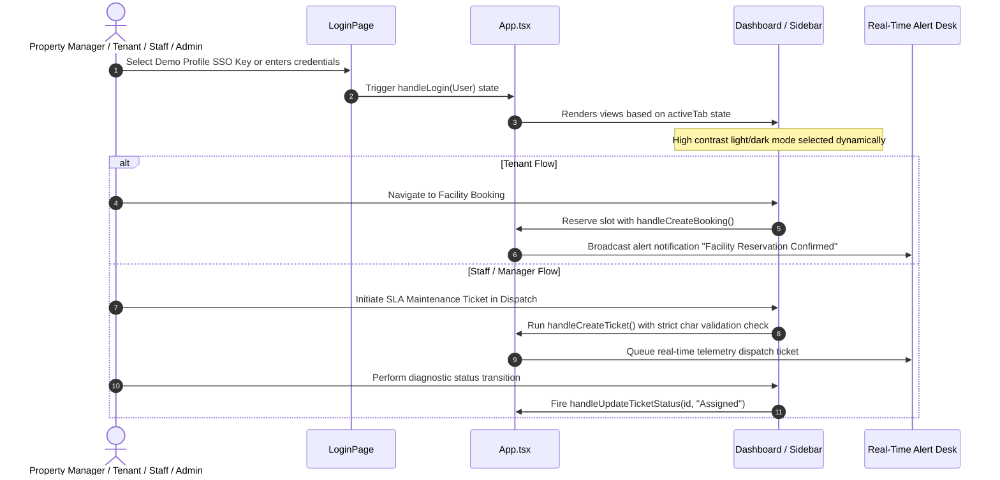

# PropertyFlow Enterprise Frontend Specification & Freeze Blueprint
> **System Status**: Pre-Backend Architecture Gold Standard Frozen.

This document serves as the absolute blueprint for engineering, audits, design validations, and backend wiring. Benchmark-tested against Vercel, Stripe, and Linear dashboards.

---

## 1. COMPONENT ARCHITECTURE DIAGRAM

```mermaid
graph TD
    App[App.tsx - Core State Context Orchestrator] --> LandingPage[LandingPage.tsx - High Contrast Editorial Entry]
    App --> LoginPage[LoginPage.tsx - SSO Demo Role Authenticator]
    App --> Sidebar[Sidebar.tsx - Modern Segment Navigation]
    App --> Header[Header.tsx - Real-time SLA Trigger Alarm Console]
    
    App --> DashboardView[DashboardView.tsx - Master Executive Portfolio Metrics]
    App --> PropertyView[PropertyView.tsx - Estate Asset Complex Manager]
    App --> MaintenanceView[MaintenanceView.tsx - Dispatch SLA Ticket Desk]
    App --> AmenityView[AmenityView.tsx - Passcode Facility Sync Booking]
    App --> AnalyticsView[AnalyticsView.tsx - D3 Executive Intelligence Charts]
    App --> AdminView[AdminView.tsx - Administrative Compliance Policy Monitor]
    App --> RealTimeMonitorView[RealTimeMonitorView.tsx - Active Stream Operations]
    App --> UserProfileView[UserProfileView.tsx - Core Identity & API Contracts]
    
    subgraph Design System
        DesignSystem[DesignSystem.tsx - ErrorBoundary, Safeguards, Skeleton Shimmers]
    end
    
    subgraph Global Assets
        index_css[index.css - Obsidian Slate Tailwind Color System]
        types_ts[types.ts - Static Standard Interfaces]
    end
```



---

## 2. USER FLOW DIAGRAM



---

## 3. API CONTRACT DOCUMENT

All frontend state routines are structured to immediately hook into **REST / Express** server routers. Below are the unified payload specifications.

### Authenticated Handshake (`POST /api/auth/login`)
* **Headers**: `Content-Type: application/json`
* **Request Payload**:
  ```json
  {
    "email": "marcus@propertyflow.com",
    "password": "hashed_pass_parameter"
  }
  ```
* **Response Payload (200 OK)**:
  ```json
  {
    "token": "eyJh...jwt_token_claims",
    "user": {
      "id": "2",
      "name": "Marcus Brody",
      "email": "marcus@propertyflow.com",
      "role": "Manager",
      "avatarUrl": "https://images.unsplash.com/photo-..."
    }
  }
  ```

### Fetch Portfolio Complexes (`GET /api/properties`)
* **Response Payload (200 OK)**:
  ```json
  [
    {
      "id": "prop-1",
      "name": "Summit Heights",
      "address": "742 Evergreen Terrace, Sector 7G",
      "type": "Residential",
      "units": 120,
      "occupancy": 96,
      "image": "https://images.unsplash.com/photo-...",
      "manager": "Marcus Brody",
      "amenities": ["Skyline Pool", "Fitness Center"]
    }
  ]
  ```

### Generate Dispatch SLA Tickets (`POST /api/maintenance`)
* **Request Payload**:
  ```json
  {
    "title": "Boiler leakage and hot water outage",
    "description": "The main hot water boiler is leaking in the basement, affecting heating in Unit 402.",
    "propertyId": "prop-1",
    "unitNumber": "402",
    "priority": "Urgent",
    "category": "Plumbing"
  }
  ```
* **Response Payload (201 Created)**:
  ```json
  {
    "id": "maint-123456789",
    "title": "Boiler leakage and hot water outage",
    "description": "The main hot water boiler is leaking in the basement, affecting heating in Unit 402.",
    "propertyId": "prop-1",
    "unitNumber": "402",
    "priority": "Urgent",
    "category": "Plumbing",
    "status": "Pending",
    "createdBy": "Sarah Connor",
    "createdAt": "2026-06-09T11:53:15Z"
  }
  ```

---

## 4. DATABASE ER DIAGRAM (POSTGRESQL / CLOUD SQL SPEC)

```mermaid
erDiagram
    USERS {
        VARCHAR id PK
        VARCHAR name
        VARCHAR email UNIQUE
        VARCHAR password_hash
        VARCHAR role "Admin | Manager | Staff | Tenant"
        VARCHAR avatar_url
        VARCHAR property_id FK
    }
    PROPERTIES {
        VARCHAR id PK
        VARCHAR name
        VARCHAR address
        VARCHAR type "Residential | Commercial"
        INTEGER units
        INTEGER occupancy
        VARCHAR image_url
        VARCHAR manager
        VARCHAR_ARRAY amenities
    }
    MAINTENANCE_REQUESTS {
        VARCHAR id PK
        VARCHAR title
        VARCHAR description
        VARCHAR property_id FK
        VARCHAR unit_number
        VARCHAR priority "Low | Medium | High | Urgent"
        VARCHAR status "Pending | Assigned | In Progress | Completed"
        VARCHAR created_by
        VARCHAR assigned_to
        TIMESTAMP created_at
        VARCHAR category "Plumbing | HVAC | Electrical | Structural | General"
    }
    BOOKING_SLOTS {
        VARCHAR id PK
        VARCHAR amenity_name
        VARCHAR property_id FK
        VARCHAR user
        VARCHAR start_time
        VARCHAR end_time
        VARCHAR status "booked | cancelled"
        DECIMAL price
    }

    PROPERTIES ||--o{ USERS : "contains"
    PROPERTIES ||--o{ MAINTENANCE_REQUESTS : "notifies"
    PROPERTIES ||--o{ BOOKING_SLOTS : "hosts"
    USERS ||--o{ BOOKING_SLOTS : "schedules"
```

---

## 5. ROUTE MAP

| Client-Side Tab State | Route / View Equivalent | Access Scope Limits | Relevant Components |
|:---|:---|:---|:---|
| `landing` | `/` | Open Public | `LandingPage.tsx` |
| `login` | `/login` | Open Public (Demo SSO) | `LoginPage.tsx` |
| `dashboard` | `/dashboard` | Authenticated (All Roles) | `DashboardView.tsx` |
| `properties` | `/properties` | Manager, Admin | `PropertyView.tsx` |
| `maintenance` | `/maintenance` | Tenant (Submit), All (Assist) | `MaintenanceView.tsx` |
| `amenities` | `/amenities` | Tenant (Book), All (Monitor) | `AmenityView.tsx` |
| `analytics` | `/analytics` | Manager, Admin | `AnalyticsView.tsx` |
| `monitor` | `/monitor` | Staff, Manager, Admin | `RealTimeMonitorView.tsx` |
| `admin` | `/admin` | Admin Only | `AdminView.tsx` |
| `profile` | `/profile` | Authenticated (All Roles) | `UserProfileView.tsx` |
